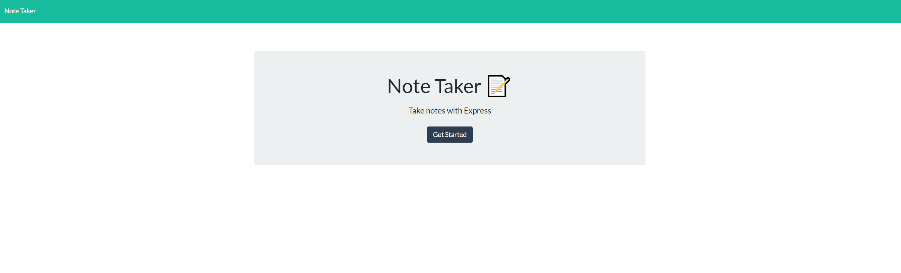
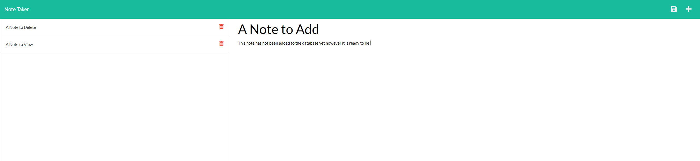

# Note Taker

A simple app which stores notes in a json file and reads them to a webpage. Store notes persistently across sessions, delete them, and add dynamically to the database.

## Future Features and Known Issues

- Only one db file for all users makes for an awkward experience if more than one person uses this app
- No password protections/sanitation
- Please don't hack me

## Considerations

While this app is fairly primitive in functionality, I am extremely excited to springboard in to actual database management and creating an interesting user experience.

## The Finished Product

Link to deployed Heroku Site: [Heroku Deployment](https://rocky-chamber-07129.herokuapp.com/)

Homescreen:

Notepad:

### Credits and Contributions

- Front end work was completed by Trilogy Education Services as part of the Denver University Bootcamp
- App utilizes the express framework in Javascript
